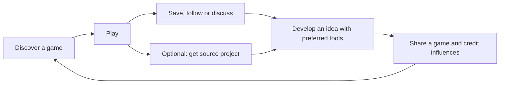

**VibeGames: product, design, community and source marketplace plan**

Prepared September 5, 2026. Recommended direction: a welcoming place to discover AI-made games, meet their creators, collect ideas, publish experiments and optionally buy useful source projects.

**The strategic recommendation**

Make VibeGames the place where playing a small game starts someone's next creative project. The central experience should connect discovery, people and creative progress. Source purchases support that experience; integrated generation can remain a later option.

Suggested positioning: **“Play something unexpected. Make something inspired.”**

Supporting copy: “Discover and share games made with AI. Meet the creators, collect ideas, and share what you make.” Once real source delivery is available, add: “Want a head start? Get source projects from their creators.”

The most promising early audience is people experimenting with AI-assisted game creation who also enjoy playing and collecting other people's experiments. Casual players remain welcome without being asked to become developers. Focus launch acquisition on this audience before attempting a mass-market entertainment feed.

**1. What I reviewed, and what needs attention now**

I inspected the live homepage, game catalogue, Bit Butcher's game page and launch screen, a creator profile, the logged-out upload redirect, mobile homepage/reels, mobile browse and the source-purchase drawer. Screenshots used 1440 × 1000 desktop and 390 × 844 mobile viewports. I also inspected the repository's discovery, publishing, social and download implementation, and current official competitor pages.

This was a product audit, not a complete device, security or performance certification. Upload administration, real purchases, payouts and authenticated journeys were not exercised. Search input and its updating state were observed; final search-result correctness was not established. Local implementation findings do not prove every production backend detail. No payment details were entered and no public content was submitted.

| Priority | Evidence | Recommended change |
|---|---|---|
| Immediate | The live mobile drawer requests card number, expiry and CVC and promises a full source package. The local component simulates success with timers and downloads HTML embedding the hosted game. | Disable the apparent checkout until genuine payment and editable-source fulfillment exist. Make availability truthful. |
| Immediate | The mobile game's “Tap to play” button renders above the checkout fields. | Fix overlay ownership, focus and background interactivity across all drawers. |
| High | “Build a game” links to upload; logged-out visitors reach sign-in. | Rename it “Share your game.” Explain supported uploads before asking someone to sign in. |
| High | Homepage hero occupies most of the first desktop screen. On Browse, thumbnails start around y=795; on the tested mobile viewport, only the beginning of a thumbnail reaches the bottom edge. | Shorten the introduction and collapse filter scaffolding. Show meaningful game choices immediately. |
| High | Desktop and mobile have markedly different navigation; mobile reels emphasize action icons and code price without a visible platform creator byline. | Preserve consistent access to discovery, creator identity, saving and game details across devices. |
| High | Local “Trending” ordering uses lifetime plays. | Use honest labels now; introduce recent activity and fair new-creator exposure when enough signal exists. |
| Medium | Profiles foreground several counts, including zero counts; cards often foreground a model name and the generic category “Other.” | Lead with the creator's interests and the game's interesting mechanic. Improve metadata. |
| Medium | At inspection, the homepage displayed 37 games, four creators and 507 plays; its jam promotion led to a completed one-entry event. | Treat this as an early community. Curate a strong small selection and an active invitation instead of making scale the opening argument. |

Evidence: [desktop homepage](A:/vibegames.ai/output/playwright/strategy-audit-2026-09-05/home-desktop.png), [desktop browse](A:/vibegames.ai/output/playwright/strategy-audit-2026-09-05/games-desktop.png), [mobile browse](A:/vibegames.ai/output/playwright/strategy-audit-2026-09-05/games-mobile.png), [mobile checkout](A:/vibegames.ai/output/playwright/strategy-audit-2026-09-05/home-mobile-code-drawer.png). Implementation: [download component](A:/vibegames.ai/src/components/games/download-code-button.tsx:39), [simulated payment](A:/vibegames.ai/src/components/games/download-code-button.tsx:95), [discovery ordering](A:/vibegames.ai/src/lib/discovery.ts:6).

The current product has valuable foundations: instant browser access, distinctive visual identity, profiles, follows, threaded comments, structured creator feedback, publishing previews, jams and analytics. Preserve and connect those features.

**2. Competitive position**

| Platform | Established promise | VibeGames' response |
|---|---|---|
| Nanogram | Creator network, fast swipe discovery, instant play and prompt-based creation. | Match clarity and low-friction play. Give visitors more help turning an interesting game into an idea they can develop. |
| Remix | Browser games, discovery, creators, creation and rewards. It also describes creator-owned source and supports existing HTML uploads. | External uploads, remixing and ownership alone are insufficient differentiation. Offer consistently useful project handoffs and thoughtful discovery. |
| itch.io | Independent publishing, browser games, creator pricing, following and collections. | Build a focused AI-game community with a more guided path from playing to understanding and adapting a project. |
| Rosebud | A generation-led entry point built around prompting and templates. | Lead with playable work and its creators. Put optional creation tools behind the community experience. |

Sources: [Nanogram](https://nanogram.app/), [Remix](https://remix.gg/), [Remix source ownership](https://remix.gg/changelog/2026-04-03-build-a-game-by-describing-it), [Remix upload integration](https://github.com/farworld-labs/remix-skills/blob/master/skills/remix-upload-game/SKILL.md), [itch.io pricing](https://itch.io/docs/creators/pricing), [itch.io community features](https://itch.io/docs/general/faq), [Rosebud](https://rosebud.ai/).

The competitive hypothesis is the combination of **playable inspiration + approachable creators + visible credit + reliable source projects**. Test it with users. No single feature guarantees defensibility; a trusted catalogue and returning community are the assets that can compound.

**3. Redesign the first visit around games**

Desktop navigation: **Explore · Collections · Jams**, a search field, **Share your game**, and account controls. Launch Collections only when it contains useful material. Put the creator dashboard under the account menu and move Blog to a secondary resource position.

Mobile navigation: **Explore · Quick play · Saved · Profile**, with publishing accessible from Profile and a clear “Share your game” action. Search remains visible within Explore. During fullscreen play, prioritize the game, an obvious exit and a compact details control.

Recommended homepage order:

1. A compact welcome with the proposed positioning and “Explore games” / “Share your game” actions.
2. Three to six curated games with an image, creator and a sentence explaining their appeal.
3. “Find your next idea”: a few collections such as One-button wonders, Clever physics and Cozy worlds.
4. “Fresh experiments” and “Looking for feedback,” using real inventory. Omit empty sections.
5. A creator spotlight showing a game, a short story and a follow action.
6. A live community challenge when there is one; otherwise an evergreen invitation to contribute.

For returning visitors, bring saved games, recent updates and followed creators forward. Preserve their scroll position when they return from a game. Avoid repeating the full introductory hero on every visit.

Acceptance target: at 1440 × 900 and 390 × 844, the initial Explore view should show at least one complete, understandable game choice and its play action. A visitor should be able to explain both “I can play games” and “I can share my own” after a brief first look.

**4. Keep the personality; improve the visual hierarchy**

The arcade identity is worth keeping. Reserve pixel typography for the logo, short headlines and occasional game-like accents. Use the existing readable sans-serif style for navigation, descriptions, forms, instructions and purchase information.

Use a dark neutral canvas, a clear primary accent and restrained secondary colors. Let game art supply most of the visual variety. Reduce nested boxes, heavy outlines, all-caps labels and simultaneous accent colors. Give primary actions stronger emphasis than metadata.

Make gameplay media the focus: consistent preview framing, legible titles, a creator byline and an interesting one-line hook. Allow silent previews on deliberate hover or tap, with motion preferences respected. Avoid text over busy moving gameplay in the main introduction.

Replace the permanent promotional ticker with a concise announcement only when it contains a useful, timely message. “New games daily” should reflect actual publishing activity. Show small-community facts accurately where useful, without making raw counters the main reason to join.

Cover keyboard navigation, visible focus, readable contrast, text resizing, reduced motion, comfortable touch targets and clear error messages. Check real touch devices in addition to emulated viewports. Drawers must capture focus and stop underlying game controls receiving input.

**5. Make discovery spark ideas**

Change cards from a data inventory into an invitation. Example:

> **Bit Butcher** · by Sajid Ahmed  
> Hold, aim and release to slash through a retro survival arena.  
> Touch controls · Action  
> **Play** · Save

Keep tool/model information in details or an optional builder filter. It can be interesting context, but the game should earn attention through its idea and experience.

Start with a small, maintained set of filters: genre, mood, input/device, short-session suitability and source availability. Builder details can add engine, format and setup difficulty when source listings exist. Avoid dozens of near-empty taxonomy pages.

Launch editorial collections such as “Five games with surprising controls” and “Small worlds with strong atmosphere.” Add a short curator explanation to each selection. Let users privately save games into named collections, then optionally publish and share a collection.

Separate public appreciation from private saving. The current implementation derives likes from favorites, so this needs a data-model change rather than a second button pointing to the same action. Preserve existing saved content during migration.

Use editorial picks and fresh releases first. A later ranking can combine recent qualified play, return visits, saves and constructive participation, with confidence weighting and limits on domination by a single creator. Reserve exposure for new submissions. Do not present lifetime totals as current momentum.

**6. Make each game page a bridge to its creator**

Order the experience as: game and controls; title/creator; save/appreciate/share; creator story; discussion; optional source project; related ideas. On desktop, source information can live in a secondary panel. On mobile, keep the same functions in a well-behaved details sheet.

Offer one clear platform-level play action, then any start interaction intrinsic to the game. Support inline play where it works; offer fullscreen deliberately when controls or orientation need it. Include retry, sound, exit and compatibility guidance. The tested Bit Butcher launch reached its own start screen; verify the whole play session separately before marking it fully checked.

Add an optional, short “Behind the game” format:

- What idea were you exploring?
- What makes this mechanic interesting?
- What was difficult, and what did you learn?
- What would you change next?

Prompts, tools and iteration screenshots are optional. Do not make extensive documentation a barrier to sharing a first experiment.

Distinguish **“Inspired by”** from **“Built from this source project.”** The first credits an influence; the second records an actual project relationship and version. Require source-use permissions where appropriate. Purchasing source does not automatically grant ownership of other people's ideas or unrelated assets.

Example journey: someone plays Bit Butcher, saves it to “Combat ideas,” reads how its slash mechanic works, makes a different game using their preferred tools, and publishes it with an inspiration credit. Buying the original project is an optional shortcut along that journey.

**7. Make publishing friendly and first-time creators feel seen**

Explain accepted formats and show an example before sign-in. Preserve the visitor's intended destination after registration: saving, following and buying should return to that action. Creator-dashboard setup belongs to publishing.

Use a short publishing sequence: **Upload and preview → Describe the game → Publish**. Reuse the existing HTML/ZIP, preview, screenshot, draft and feedback capabilities. Put advanced options behind progressive disclosure.

Ask for a title, a useful thumbnail, a short hook and working controls/device information. Offer optional creator notes and inspiration credits. Treat source upload as a separate opt-in: **Play only · Free source · Paid source**. Someone publishing a game must never accidentally authorize source sales.

Make profiles feel like people: “What I like making,” current experiment, pinned games, collections and recent updates. Show meaningful accomplishments when earned. Keep detailed metrics in the creator dashboard. Make studio identities consistently followable.

Create a small operating routine: welcome new creators, play their first release, and provide one specific response. Aim for useful feedback within 48 hours during the pilot, supported by actual community staffing. Measure that promise before advertising it broadly.

Use the existing structured feedback system for “I got stuck when…,” “The part I enjoyed was…” and “An idea you could try…”. Let creators choose whether they want critique. Provide reporting, blocking and a clear process for harassment and copied uploads.

**8. Turn the $1 purchase into a dependable product**

Keep $1 as the suggested entry price and let creators choose higher prices. Keep playing free. A source button should appear only when that creator has explicitly supplied and enabled an appropriate package.

Sell a head start: an editable project that matches the demo, organized files, setup instructions and clear reuse permissions. Reconstructing a game may take longer or cost more, but that is not universally true. For single-file games, the delivered project can closely resemble the browser payload; describe it honestly.

Before checkout show: price and currency, included files, project format, engine/version, required tools or services, last tested date, source version, asset exclusions, support/update scope and a plain-language license summary. Provide a README and a few suggested changes a buyer can try. Label any “tested” badge with exactly what was tested.

Use a suitable provider's hosted checkout after confirming marketplace support for the operating entity and seller countries. Add verified payment events, orders, download entitlements, protected versioned archives, receipts, re-download access, creator earnings and refund/support handling. Test duplicate and delayed payment notifications, failed payment, successful payment with failed delivery, refunds and package updates. A browser-only success state is insufficient.

License decisions must clearly cover modification, attribution, commercial use, redistribution and excluded assets. Do not call paid code “open source” unless its actual license qualifies. Have the selected terms and sales process reviewed for the jurisdictions you operate in before a paid launch.

For an **illustrative US domestic-card transaction**, Stripe lists 2.9% + $0.30. A $1 sale leaves about $0.67 after that processing fee; a $5 sale leaves about $4.56. These are calculations, not your expected payout. Platform costs, marketplace/payout fees, refunds, support and applicable taxes are additional considerations. Geography and provider configuration remain unresolved. [Stripe pricing](https://stripe.com/pricing), [Connect pricing](https://stripe.com/connect/pricing).

Model a transparent commission before choosing it. At an illustrative 15% of the $0.671 remaining after basic processing, the platform receives roughly $0.101 and the creator $0.570, before other costs. This demonstrates why volume alone may not make $1 transactions sustainable. It is a scenario to validate, not a fee recommendation ready to publish.

Pilot individual purchases first; offer optional bundles when users want several projects. Avoid requiring a wallet balance just to buy a $1 game. Do not introduce complex downstream royalty chains in the first release.

**9. Treat playability and trust as part of the experience**

Define “ready to play”: the game loads, essential assets resolve, controls work on its claimed devices, sound follows user intent, and there is an obvious restart/exit path. Check the promoted catalogue manually now and add automated checks gradually. Separate playful unfinished experiments from clearly broken releases.

Validate actual source archives independently from playable builds: no exposed keys, credentials, unexpected executables or missing essential files. Review initial paid listings manually and verify a representative setup from a fresh environment. Uploaded code and game frames need isolation from account and checkout surfaces; review the current sandbox/origin configuration before expanding uploads.

Measure route responsiveness and time from pressing Play to usable gameplay on target devices. Avoid loading every reel simultaneously. Pause inactive games, respect bandwidth, and use stable thumbnails/loading feedback. Review the homepage's existing database work before adding more feeds: the repository already fetches some unused discovery sections.

Use truthful empty states, useful retry actions, and clear explanations when a game is desktop-only. Do not silently turn a failed load into a counted successful play.

**10. Grow a community through a small, deliberate launch**

Recruit an initial cohort of roughly 10–20 creators across several creation tools. These are proposed recruitment targets, not current numbers. Help each publish one or two good examples, write an interesting hook and identify a useful experiment for others.

Run a recurring small challenge only at a cadence the cohort can sustain. Themes such as “One button, surprising result,” “Make failure fun” or “A cozy 60-second world” encourage creative decisions. Allow iteration; make one-shot prompting a special event rather than the main definition of creativity. The current [jam page](https://www.vibegames.ninja/jams) promotes a completed one-shot challenge.

Publish creator spotlights and collections that are worth sharing independently of an announcement about the platform. Improve game share cards with actual gameplay, creator credit and a direct play link. Reuse existing embed and social-preview routes after verifying them. Build searchable, useful collection and creator pages with original descriptions; avoid mass-produced thin SEO pages.

Follow notifications should emphasize meaningful new releases, updates and replies. Offer digest preferences and avoid repeated engagement nags. Recognize helpful feedback and inventive remixes as well as popular games.

Postpone broad paid acquisition until visitors reliably reach games, creators receive useful responses and repeat visits appear in several cohorts. A small active community is a better launch base than many unsupported uploads.

**11. Sequence the work over approximately 90 days**

This is a planning sequence for a small team, not a delivery guarantee. Payment-provider approval and seller onboarding can run in parallel from the first week. Keep the quality gates even if dates move.

| Phase | Work | Completion gate |
|---|---|---|
| Days 1–7: truthful foundations | Disable simulated checkout; correct Build/Upload labels; fix mobile overlay problems; audit featured games; record baseline funnels. | Every visible action makes an accurate promise; five new visitors can find and launch a game without coaching. |
| Weeks 2–4: discovery and visual design | Compact homepage/browse layout, game-first cards, simpler navigation, usable mobile details, public creator identity, better metadata, existing fresh/feedback lanes. | Meaningful games visible in initial desktop/mobile Explore views; reliable launch/exit; no modal overlap; key flows work with keyboard and touch. |
| Weeks 5–8: creative community | Separate saves/appreciation, simple collections, creator notes, inspiration credits, registration return paths, followed releases, staffed first-release feedback. | Pilot creators receive useful responses; observed visitors save and revisit ideas; several publish or describe a concrete next project. |
| Weeks 9–12: paid-source pilot | Reviewed source packages, licensed listings, hosted checkout, verified fulfillment, purchase library, earnings and support. Start with about 10 sellers and 20 projects if supply supports it. | End-to-end payment/fulfillment failure cases tested; pilot buyers can run and modify projects; real fees and support load measured. |

Founder/community owner: curation, creator recruitment, feedback and interviews. Product/design owner: information architecture, copy and usable interaction flows. Engineering owner: source-delivery trust, shared components, data migration, performance and instrumentation. These may be the same people; reserve explicit time for community work.

If resources are tight, ship the first two phases and operate the community manually before building a large marketplace. Research provider feasibility early so it does not become a late surprise. An integrated generator, native mobile app, subscriptions, paid ranking and advanced recommendation engine should wait for demonstrated demand.

**12. Measure whether the platform creates creative momentum**

Use **weekly returning explorers** as an initial retention measure: people who return and successfully play at least one game. Pair it with a **creative follow-through rate**: the proportion of qualified explorers who save an idea, follow a creator, contribute useful feedback or publish an inspired project. Report those actions separately so easy saves cannot hide weak deeper participation.

Track the following funnels with device and acquisition-source breakdowns:

- Visit → see a game → press Play → game ready → meaningful interaction → return within seven days.
- Play → save/follow/read creator notes → return to an idea → publish an inspired game.
- Start upload → preview successfully → publish → first external play → first useful response → next release.
- Source details → checkout → confirmed purchase → successful download → reported local run → meaningful modification/republication.

Exclude creator self-plays and obvious automated traffic from success counts. For games that cannot emit reliable readiness/activity signals, label proxy measurements honestly. Measure local source-run success through voluntary pilot follow-up; a download event alone does not establish it.

Suggested initial targets, to revise after a baseline: 80% of pilot first releases receive a useful response within 48 hours; 90% of responding pilot buyers can run their source project; play-start failures decrease; seven-day return improves across successive cohorts. Always include raw sample counts. These are proposed internal goals, not industry benchmarks.

Before spending heavily, interview several returning players, first-time creators and source buyers. Ask what interested them, what they saved, what they actually changed and whether the package saved effort. Real repeated behavior should determine which features expand.

**Implementation starting points already in the repository**

| Existing area | Reuse or adjustment |
|---|---|
| [Homepage data](A:/vibegames.ai/src/lib/home-page-data.ts:524) and [homepage rendering](A:/vibegames.ai/src/app/page.tsx:107) | Fresh, feedback and update data already exist; surface the useful portions while removing unnecessary work. |
| [Game cards](A:/vibegames.ai/src/components/games/game-card.tsx:128) | Prioritize gameplay hook and creator; demote model metadata. |
| [Play page](A:/vibegames.ai/src/components/games/play-page-view.tsx:193) and [mobile feed](A:/vibegames.ai/src/components/home/mobile-reels-feed.tsx:957) | Align details and social/source actions across devices. |
| [Publishing UI](A:/vibegames.ai/src/components/upload/upload-page-client.tsx:872) | Preserve draft/preview support; add optional story and a genuinely separate source-package flow. |
| [Creator profile](A:/vibegames.ai/src/app/(main)/creator/[username]/page.tsx:261) and [feedback inbox](A:/vibegames.ai/src/components/creator/creator-feedback-inbox.tsx:146) | Connect existing community capabilities to discovery and first-release support. |
| [Likes/favorites endpoint](A:/vibegames.ai/src/app/api/games/[id]/like/route.ts:58) | Separate public appreciation from private saving with a safe data migration. |
| [Registration](A:/vibegames.ai/src/app/(auth)/register/page.tsx:77) | Restore the visitor's intended action after signup. |
| [Data schema](A:/vibegames.ai/prisma/schema.prisma:123) | Add distinct source packages/versions, licenses, orders, entitlements and seller records; keep payment for source separate from access to play. |

The next concrete design deliverables should be the Explore homepage, a game card, the game-details view, a creator profile, the publishing flow and the source-project listing/checkout handoff, each covering desktop, mobile, loading and empty states. Validate those journeys with a small cohort before broad implementation.
